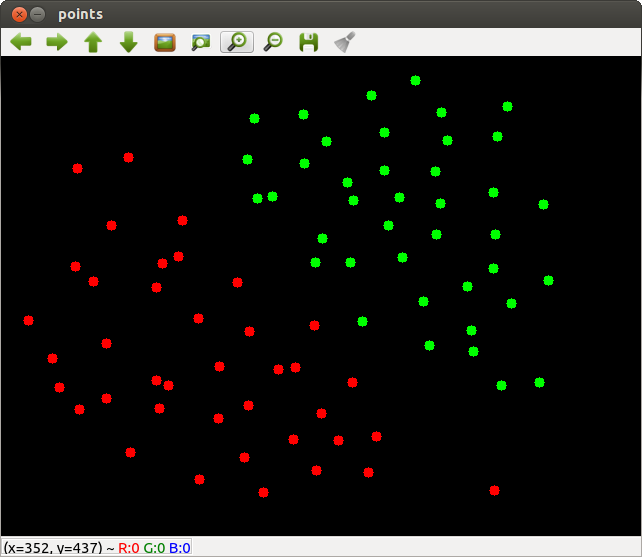
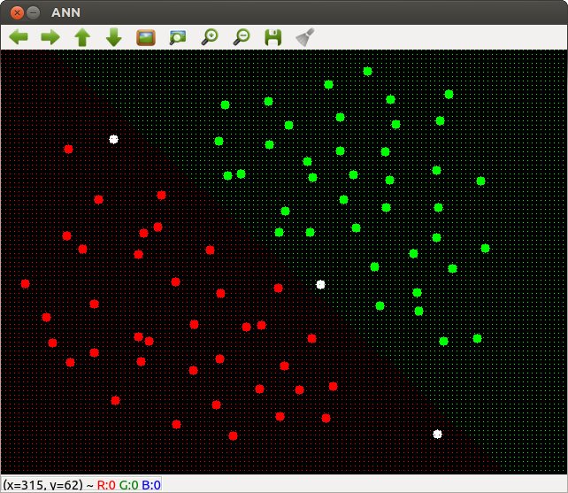
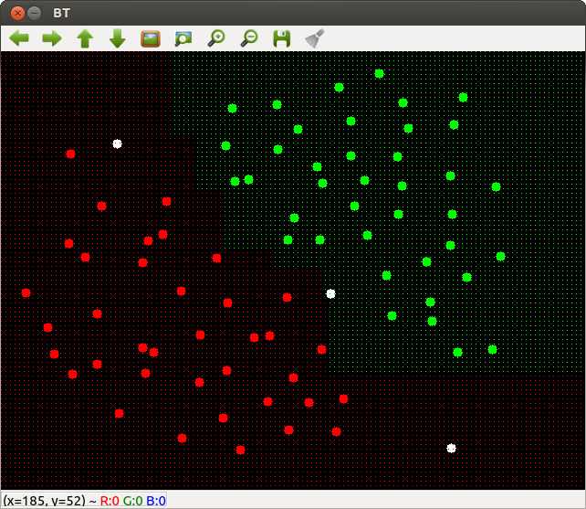
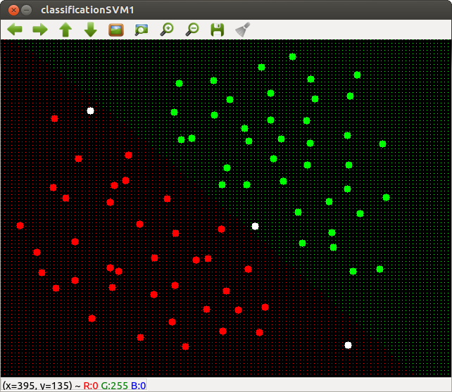
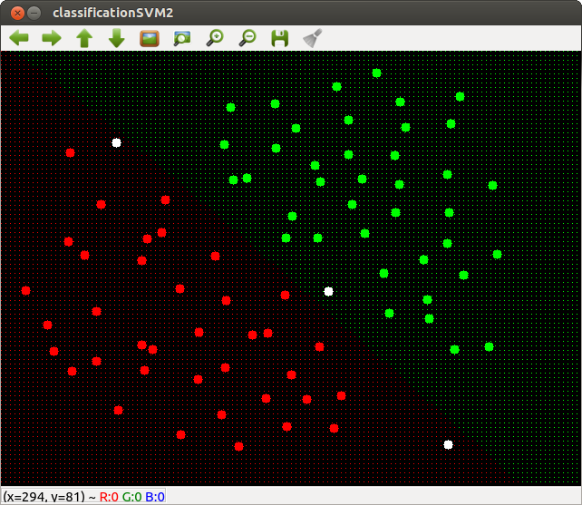
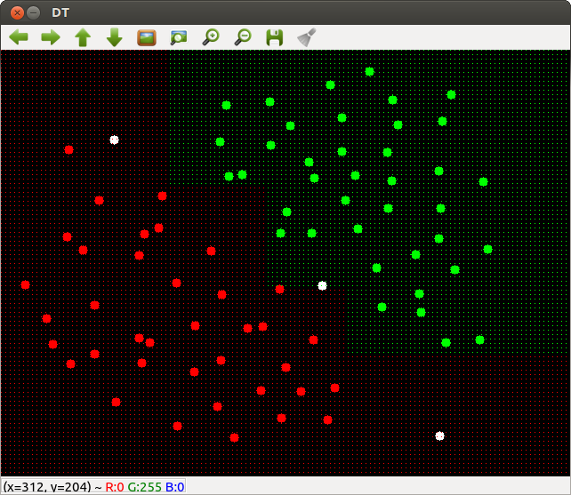
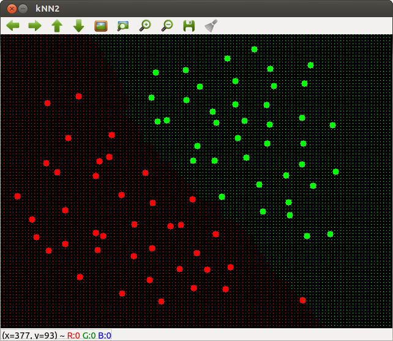
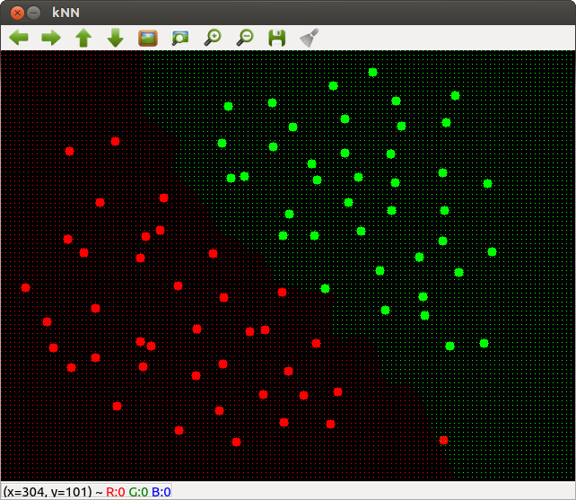
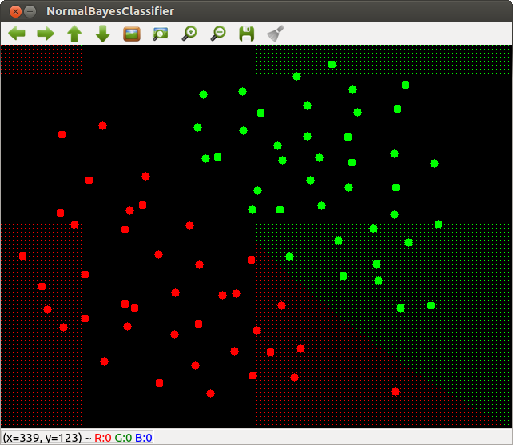

# PointsClassifier

Machine Learning: OpenCV Points Classifier Demo

(https://github.com/Itseez/opencv/blob/master/samples/cpp/points_classifier.cpp)

## Compile:

```shell
$ gcv points_classifier.cpp points_classifier
```

### Note:

gcv alias in '~/.bashrc':
'
```shell
gcv () { g++ -std=c++11 `pkg-config --cflags opencv` "$1" `pkg-config --libs opencv` -o "$2";}
```

### Run

```shell
$ gcv points_classifier.cpp points_classifier
$ ls
points_classifier  points_classifier.cpp
$ ./points_classifier 
Use:
  key '0' .. '1' - switch to class #n
  left mouse button - to add new point;
  key 'r' - to run the ML model;
  key 'i' - to init (clear) the data.

init done 
opengl support available 

```

### Input Data point:



## Screenshots:

### Artificial Neural Network



### ADA Boost



### Support Vectors Machine (C = 1)



### Support Vectors Machine (C = 10)



### Decision tree



### Expectation maximization


### k nearest neighbors (KNN) classifier (k = 3)



### k nearest neighbors (KNN) classifier (k = 15)



### Normal Bayes Classifier




"**A
computer
program
is
said
to
learn
from
experience
E
with
respect
to
some
task
T
and
some
performance
measure
P,
if
its
performance
on
T,
as
measured
by
P,
improves
with
experience
E.**" - Tom Mitchell
